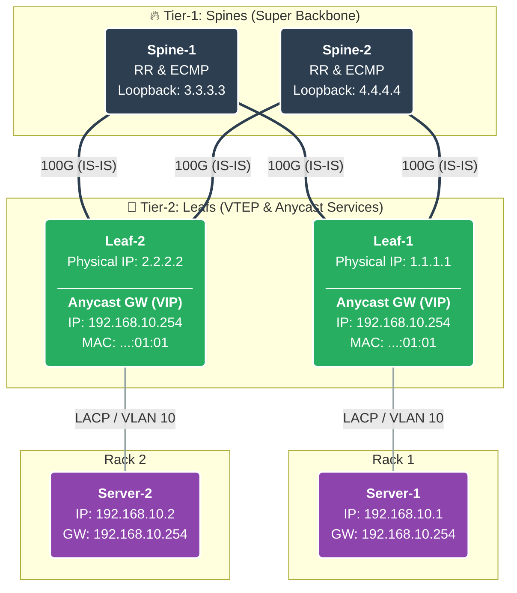

# ☁️ Cloud-Native Data Center Fabric with Contatinerlab


> A containerized Cloud-Native DC Fabric built with Nokia SR Linux (CNFs Routers). Implements a resilient Clos (Leaf-Spine) topology using BGP-EVPN/VXLAN. Fully automated via Containerlab to simulate hyperscale infrastructure suitable for Cloud and HPC workloads.
> 
> ### 🎯 Design Principles
* **🛡️ Resiliency:** Elimination of Single Points of Failure (SPOF) via Clos topology and  ECMP.
* **🚀 Performance:** Non-blocking East-West traffic optimization using VXLAN overlays.
* **🤸 Agility:** Seamless VM/Container *mobility* with Distributed Anycast Gateways.
* **🔐 Multi-Tenancy:** Hard isolation between tenants using VRFs and BGP-EVPN signaling.

**⚡ Simplicity: Spin up the entire Digital Twin lab with just one line of code!**

---

## 🏗️ Architecture Overview

The fabric is built on a **2-Stage IP Clos** topology, leveraging open standards (RFC-based) to ensure vendor interoperability and scalability.

| Component | Specification | Rationale |
| :--- | :--- | :--- |
| **Topology** | 2-Spine / 2-Leaf | Provides redundancy and demonstrates ECMP load balancing. Scalable horizontally. |
| **Underlay** | IS-IS Level 2 | Chosen for fast convergence, simplicity, and native Segment Routing support. |
| **Overlay** | MP-BGP EVPN | The industry standard control plane for MAC/IP learning, replacing legacy Flood-and-Learn. |
| **Data Plane** | VXLAN | Encapsulation protocol enabling Layer 2 extension over Layer 3 boundaries. |
| **NOS** | Nokia SR Linux | Open, model-driven, and Linux-native Network Operating System. |

### 🧩 Logical Topology (Clos)
*(Rendered live via Mermaid.js)*


### ⚡ Quick Start (Deploy in 60 Seconds)

Get the Digital Twin running on your laptop in **4 simple steps.**

> **Prerequisites:** `Linux VM /WSL2`, `Docker`, `Containerlab`.
>
> Don't have Containerlab? Install it: ```bash -c "$(curl -sL https://get.containerlab.dev)"```

### 1. Clone the Repository
Pull the infrastructure code and navigate to the project directory.

```bash
git clone https://github.com/YOUR_USERNAME/Cloud-Native-DC-Fabric-with-Contatinerlab.git
cd Cloud-Native-DC-Fabric-with-Contatinerlab
```
### 2. Deploy the Fabric
Spin up the topology. 
This command will pull the Docker images and pushes the **Zero Touch Provisioning (ZTP)** configs.

```bash
sudo containerlab deploy -t clab-topology/fabric.clab.yml --reconfigure
```
### 3. Visualize
Access the **Containerlab Graph GUI** to view the real-time network topology **in your browser.**

**Run the GUI server:** 
```bash
sudo containerlab graph -t clab-topology/fabric.clab.yml
```
**Open**: http://localhost:50080

### 4. Validation test
Verify the overlay data plane by pinging between the two isolated Servers over the VXLAN fabric.
```bash
docker exec -it clab-evpn01-srv1 ping 192.168.10.2
```
### 5. Destroy the lab! 🧹
Finished exploring? Gracefully stop and free up system.
```bash
sudo containerlab destroy -t clab-topology/fabric.clab.yml --cleanup
```

**🙌 Thank You!**

Thanks for deploying the Cloud-Native DC Fabric. I hope this provided valuable insights into modern, automated Data Center architectures.

**Feel free to ⭐ the repository if you found this engineering useful!**

### 🔮 Roadmap & Future Evolution
This project is designed to evolve from a static fabric to a fully observable, self-driving network.

**[x] Phase 1: Core Fabric Deployment**

    [x] Leaf-Spine Physical Topology

    [x] IS-IS Underlay
    
    [x] eBGP Underlay & EVPN-VXLAN Overlay
    
    [x] Anycast Gateway & Multi-Tenancy

**[ ] Phase 2: Modern Observability Stack**

   [ ] Streaming Telemetry via **gNMI** (replacing legacy SNMP)

    [ ] Data Collection with **Prometheus**

    [ ] Visualization Dashboards via **Grafana**

**[ ] Phase 3: Network Automation & NetOps**

    [ ] Day-2 Operations via Ansible Playbooks
    
    [ ] CI/CD Pipelines for Configuration Management (GitOps)
    
--- 
**Architected & Maintained by Tomer Philip.**
